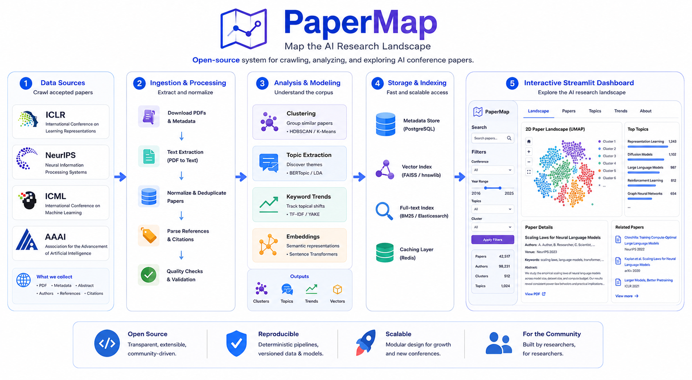

# PaperMap - Multi-Conference Paper Explorer

PaperMap is an open-source tool to crawl, analyse, and visually explore accepted
papers from major ML conferences. It includes crawler scripts, analysis pipelines,
and a unified Streamlit dashboard with topic browsing, clustering, keyword trends,
and paper-level exploration.



> Note: generated conference data is not committed to this repository because it
> can be large. After cloning, run one of the crawl scripts below to generate the
> `data/` and `analysis/` files used by the dashboard.

## Available Conferences

The unified dashboard supports:

- NeurIPS
- ICLR
- ICML
- AAAI

Generated datasets are stored by conference and year, for example:

- `neurips2025/data/` and `neurips2025/analysis/`
- `iclr2026/data/` and `iclr2026/analysis/`
- `aaai2026/data/` and `aaai2026/analysis/`

## Quick Start

### 1. Install

```bash
git clone https://github.com/jiayiderekchen/PaperMap.git
cd PaperMap

python -m venv .venv
source .venv/bin/activate
pip install -r requirements.txt
```

### 2. Generate Data

For OpenReview-backed conferences:

```bash
CONFERENCE=NeurIPS YEAR=2025 bash scripts/crawl_openreview.sh
CONFERENCE=ICLR YEAR=2026 bash scripts/crawl_openreview.sh
CONFERENCE=ICML YEAR=2025 bash scripts/crawl_openreview.sh
```

For AAAI 2026:

```bash
bash scripts/crawl_aaai.sh
```

The scripts crawl accepted papers, run clustering, compute corpus statistics, and
extract topics. They create the files expected by the dashboard, including
`papers_with_clusters.parquet`, `embeddings.npy`, `topic_hierarchy.json`, and
`top_keywords.csv`.

### 3. Launch the Dashboard

```bash
source .venv/bin/activate
streamlit run app/streamlit_app.py
```

Open http://localhost:8501 in your browser.

If you launch before generating data, the app will run but show a "No data found"
message for the selected conference/year.

### Optional: Use OpenReview Credentials

Public conference data may work without login, but credentials can improve rate
limits and access where OpenReview requires authentication.

```bash
export OPENREVIEW_USERNAME="your_email@domain.com"
export OPENREVIEW_PASSWORD="your_password"
```

## Features

### 🎯 Hierarchical Topic Browsing
- 13 major research topics
- 50+ subtopics per conference
- Automatic paper categorization

### 🔬 Automatic Clustering
- 50 clusters per conference
- TF-IDF + SVD embeddings
- Unsupervised topic discovery

### 🔍 Multi-Filter Search
- Full-text search
- Topic/subtopic filtering
- Cluster filtering
- Combined filters

### 📊 Paper Details
- Title, abstract, authors, keywords
- Topic assignments
- Direct links (arXiv, PDF, OpenReview)
- Related papers via similarity

## Research Insights

### ICLR 2026 vs NeurIPS 2025

| Topic | ICLR 2026 | NeurIPS 2025 |
|-------|-----------|--------------|
| **Large Language Models** | 2,162 (40%) | 1,619 (31%) |
| **NLP** | 1,696 (32%) | 1,322 (25%) |
| **Computer Vision** | 1,011 (19%) | 1,021 (19%) |
| **Reinforcement Learning** | 991 (19%) | 802 (15%) |
| **Generative Models** | 812 (15%) | 736 (14%) |

**Key Observations:**
- ICLR 2026 has stronger LLM focus (40% vs 31%)
- NeurIPS 2025 more balanced across topics
- Similar computer vision coverage
- Both conferences show heavy ML systems focus

## Technical Stack

### Data Collection
- **API**: OpenReview API v2
- **Rate Limiting**: Conservative (3s retry, 2s page delay)
- **Authentication**: Required for better rate limits

### Analysis Pipeline
- **Clustering**: scikit-learn (KMeans, TF-IDF, SVD)
- **Topic Extraction**: Rule-based keyword matching
- **Storage**: Parquet (fast columnar format)

### UI
- **Framework**: Streamlit
- **Caching**: Automatic data caching
- **Similarity**: Cosine similarity on embeddings

## Project Structure

```
paper_crawler/
├── app/                     # Unified Streamlit UI
├── crawler/                 # Shared crawler code
│   ├── run_crawl.py
│   ├── crawl_aaai_ojs.py
│   └── openreview_client.py
├── analysis/                # Shared analysis scripts
│   ├── cluster_analysis.py
│   ├── corpus_analysis.py
│   └── topic_extraction.py
├── scripts/                 # End-to-end crawl + analysis scripts
│   ├── crawl_openreview.sh
│   └── crawl_aaai.sh
├── neurips2025/             # Generated after crawling NeurIPS 2025
│   ├── data/
│   └── analysis/
├── iclr2026/                # Generated after crawling ICLR 2026
│   ├── data/
│   └── analysis/
└── README.md               # This file
```

## Adding New Conferences

To add a new conference (e.g., ICML 2025):

```bash
CONFERENCE=ICML YEAR=2025 bash scripts/crawl_openreview.sh
streamlit run app/streamlit_app.py
```

## Requirements

```bash
pip install -r requirements.txt
```

Key dependencies:
- openreview-py
- pandas
- numpy
- scikit-learn
- streamlit
- pyarrow

## Configuration

### Rate Limiting
Adjust in run_crawl.py:
- `--sleep-s`: Seconds between retries (default: 3)
- `--page-sleep`: Seconds between pages (default: 2)
- `--max-retries`: Max retry attempts (default: 5)

## Performance

| Operation | ICLR 2026 | NeurIPS 2025 |
|-----------|-----------|--------------|
| **Crawl** | ~57s | ~20s |
| **Clustering** | ~19s | ~6s |
| **Topic Extraction** | ~1s | ~1s |
| **Total** | ~80s | ~30s |

## Troubleshooting

### Rate Limit Errors
- Increase `--sleep-s` and `--page-sleep`
- Use authenticated requests
- Wait 15 seconds between runs

### UI Not Loading
- Check if port is already in use
- Try different port: `--server.port 8503`
- Clear Streamlit cache: `streamlit cache clear`

### Missing Papers
- Check venueid filter matches conference
- Verify invitation string is correct
- Some conferences use different field names

## Future Enhancements

- [ ] Author collaboration network
- [ ] Citation analysis
- [ ] Trend analysis across years
- [ ] Multi-conference comparison view
- [ ] Export to CSV/Excel
- [ ] PDF download integration
- [ ] Semantic search with embeddings

## License

MIT License - feel free to use and modify for your research needs.

## Credits

Built using OpenReview API and open-source tools.
